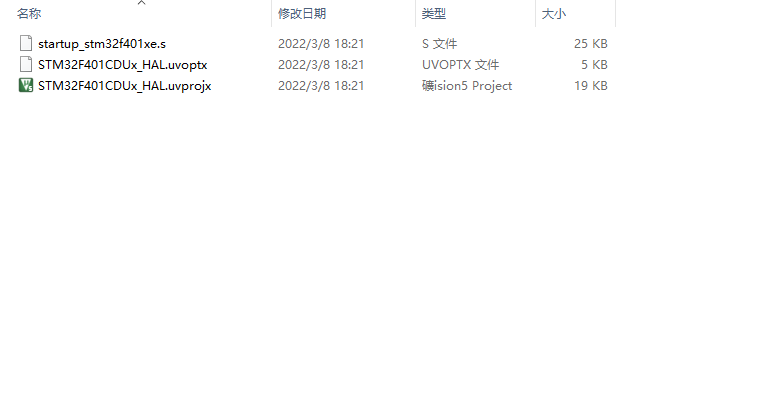
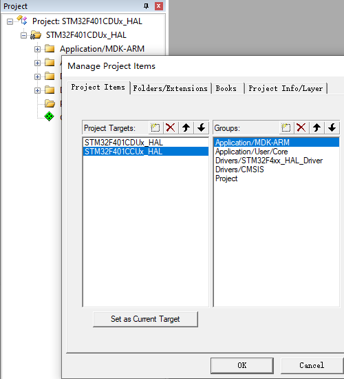
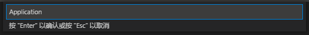
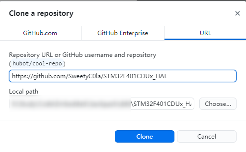

# 创建基于STM32CubeMX的快速开发模板

## 写在前面

STM32系列芯片一直是嵌入式中的热门，通过STM32HAL库和STM32CubeMX相结合，能抽象化地完成对芯片外设的初始化，解决开发中重复配置寄存器繁琐费时的痛点。

文章以此进行相关探讨，以期创建基于STM32CubeMX的快速开发模板。文章的第二章分析各个工具文件结构，配置文件的特性；第三到五章描述创建模板的具体步骤；第六章描述使用模板开发的具体步骤。

## 创建快速开发模板分析

### 回顾已有开发模板

对于STM32的开发模板，使用工具STM32CubeMX（简称CubeMX），Keil5MDK
IDE（简称MDK），Visual Studio
Code（简称VSCode）和基于VSCode的EIDE插件（简称EIDE），我们已经知道有以下这几种创建模板的方法：

1.  **对于ARMCC工具链，配置CubeMX生成MDK工程模板，使用MDK进行开发的方法；**

2.  **对于ARMCC工具链，将配置CubeMX生成的MDK工程模板，导入至EIDE，并创建EIDE项目模板，从而替代MDK进行开发的方法；**

3.  **对于GCC工具链，配置CubeMX生成Makefile文件，并创建EIDE项目模板进行开发的方法；**

**（以下简称为[ARMCC-MDK模板]方式1，[ARMCC-EIDE模板]方式2，[GCC-EIDE模板]方式3）**

因此，我们应使用前述工具，对已有的创建模板的方式探讨优劣，以此为基础创建快速开发模板。

*如果你创建模板的方法参考了*[*稚晖君的教程：配置Clion用于STM32开发*](https://zhuanlan.zhihu.com/p/145801160)*，或是*[*配置VS
Code
开发STM32【宇宙&最强编辑器】*](https://zhuanlan.zhihu.com/p/468568448)*，那么也可以参考文章结合git的部分的思路。*

### 创建模板流程分析

试回顾创建一个模板的流程，不论基于stm32标准库还是HAL库，使用MDK还是EIDE，这个流程都是相似的：

1.  **新建一个文件夹作为模板文件夹，根据需要修改其名称；**

2.  **将官方提供的库文件、用户文件和CMSIS文件等复制到文件夹内，可以选择复制完整的库相关文件或是仅复制需要的库相关文件；**

3.  **在IDE内创建工程/项目模板，并配置库相关文件目录和头文件路径；**

4.  **配置模板的其它选项，包括芯片型号，输出选项，预置宏定义，编译选项，下载与调试配置等；**

    **End. 进行后续用户开发...**

由于在开发的过程中需求是随时变化的，我们倾向于将完整的库相关文件复制到模板文件夹内，并根据需求在模板内随时修改目录结构。这样一来，我们就需要在后续开发中重复步骤3。

对于需要灵活使用hal库+ll库，从而一定程度兼顾快速和性能的开发场景，其库文件数量大，重复步骤3修改目录结构难免繁琐、冗余。特别是就目前而言(2022.3)，MDK工程与EIDE项目都不支持在图形界面内对目录进行批量修改。

通过配置CubeMX生成工程，可以在生成代码的同时自动化地修改目录结构，从而免于在开发过程中重复操作，提高开发效率。因此，基于CubeMX直接或间接创建模板，是文章所探讨的快速开发的重点。

*使用CubeMX生成工程还有一个好处——可以选择不为每个文件夹都复制完整的库相关文件，只需确保开发环境中有CubeMX及相应库文件，剩下交给生成器即可——手动创建模板则需要考虑复制完整的库文件以减少工作量。另外，减小文件夹大小对于版本管理和协作开发都更有利*

### 模板文件结构分析

<div>			<!--块级封装-->
    <center>	<!--将图片和文字居中-->
    
    <br>		<!--换行-->
    用到的工具链	<!--标题-->
    </center>
</div>     

#### CubeMX生成文件的结构

观察CubeMX生成的MDK工程和Makefile文件如下：




可以看到，MDK工程存放在MDK-ARM文件夹下，包含MDK工程文件和ARMCC工具链对应的startup_xxx.s引导文件。而Makefile生成的文件则存放在工程根目录，包含Makefile文件、GCC对应的引导文件和链接脚本。

不同工具链生成的库相关文件是相同的，它们存放在Core和Drivers两个文件夹。Drivers文件夹存放库文件和CMSIS文件，Core文件夹存放用户文件。


当在CubeMX中选中“复制全部库文件”时，CubeMX会在生成工程时将给定型号的所有库文件和CMSIS文件复制到Drivers文件夹下，大小约为几百M。

而当选中“仅复制必要库文件”时，CubeMX会在生成工程时仅复制需要的库文件和CMSIS文件。*如果此前曾选中“复制全部库文件”选项生成工程，那么这时CubeMX会删除多余的库文件，但不会完全删除多余的CMSIS文件，如果使用EIDE创建项目则需要格外留意（详见本节EIDE项目的目录结构）*。

Drivers文件夹内的库文件和CMSIS文件根据以上选项被全部复制或据需被部分复制；Core文件夹内的用户文件则往往是对库文件的调用实例，随用户开发情况而增减。

#### MDK工程的目录结构


CubeMX生成的MDK工程也采用与文件结构相近的目录结构：库文件和CMSIS文件被添加在Drivers的子目录下，用户文件和.s引导文件被添加在Application的子目录下。

#### EIDE项目的目录结构


使用EIDE创建项目并配置目录结构时，可以沿用MDK的目录结构：

对于方法2，在从MDK导入工程时会自动修改工程目录；

对于方法3，将Core文件夹和Drivers文件夹添加为EIDE特有的“普通文件夹”，使项目目录与文件结构保持同步，配合CubeMX的“仅复制必要库文件”选项，同样可以略过手动添加文件的步骤。注意若选择过“复制全部库文件”选项，则需要删除CMSIS文件夹，再切换为“仅复制必要库文件”选项生成代码，否则将会因为引入多余的头文件而报错。

### 模板配置文件分析

#### MDK工程配置文件分析

用CubeMX任意生成一个MDK工程，复制一份为副本，然后打开工程后关闭工程


在VSCode中打开.uvprojx和.uvoptx文件，进行文本对比


可以看到，工程文件实际为XML文本。在首次打开工程时，MDK会对所有没有关闭的标签进行填充和关闭，例如对内存布局的地址填充（猜测这是通过CubeMX提供的芯片型号自动补全的）等。MDK还可能额外添加一些标签。对于一个模板，应使其尽可能保持未被初始化的状态，因此这里应尝试在未被开启的工程文件上修改配置。

这里附上经过比对，一些需要修改的标签及在MDK内对应的选项：

*.uvoptx文件在开启后缩进格式会由换行符变为2个空格，在文本对比前需要先对缩进格式进行统一*

```xml
template.uvprojx: 
<Project>
  <Targets>
    <Target>
      <uAC6>1</uAC6>					Target - ARM Compiler
      <TargetOption>
        <TargetCommonOption>
          <OutputDirectory>				Output - Select Folder for Objects
          <OutputName>					Output - Name of Executable
          <ListingPath>					Listing - Select Folder for Listings
        </TargetCommonOption>
        <TargetArmAds>
          <ArmAdsMisc>
            <useUlib>					Target - Use MicroLIB
          </ArmAdsMisc>
          <Cads>
            <interw>					C/C++ - 
            <Optim>						C/C++ - Optimization
            <oTime>						C/C++ - Optimize for Time
            <SplitLS>					C/C++ - Split Load and Store Multiple
            <OneElfS>					C/C++ - One ELF Section per Function
            <Strict>					C/C++ - Strict ANSI C
            <EnumInt>					C/C++ - Enum Container always int
            <PlainCh>					C/C++ - Plain Char is Signed
            <Ropi>						C/C++ - Read-Only Position Independent
            <Rwpi>						C/C++ - Read-Write Position Independent
            <wLevel>					C/C++ - Warnings
            <uThumb>					C/C++ - Thumb Mode
            <uSurpInc>					C/C++ - No Auto Includes
            <uC99>						C/C++ - C99 Mode
            <uGnu>						C/C++ - GNU extensions
            <useXO>						C/C++ - Execute-only Code
            <v6Lang>					C/C++ - Language C
            <v6LangP>					C/C++ - Language C++
            <vShortEn>					C/C++ - Short enums/wchar
            <vShortWch>					C/C++ - Short enums/wchar
            <v6Lto>						C/C++ - Link-Time Optimization
            <v6WtE>						C/C++ - Turn Warnings into Errors
            <v6Rtti>					C/C++ - use RTTI
          </Cads>
        </TargetArmAds>
      </TargetOption>
    </Target>
  </Targets>
</Project>

template.uvoptx: 
<ProjectOpt>
    <Target>
        <TargetOption>
            <OPTLEX>
                <ListingPath>			Listing - Select Folder for Listings
            </OPTLEX>
            <DebugOpt>
                <nTsel>					Debug – Use:
                <pMon>					Debug – Use:
            </DebugOpt>
            <TargetDriverDllRegistry>	Debug – Settings – Debug & Trace & Flash Download
                <SetRegEntry>
                    <Number></Number>
                    <Key></Key>
                    <Name></Name>
                </SetRegEntry>
            </TargetDriverDllRegistry>
            <DebugDescription>			Debug – Settings – Pack
                <Enable></Enable>
                <EnableFlashSeq></EnableFlashSeq>
                <EnableLog></EnableLog>
                <Protocol></Protocol>
                <DbgClock></DbgClock>
            </DebugDescription>
        </TargetOption>
</Target>
</ProjectOpt>
```

除.uvoptx文件的标签\<ProjectOpt\>\<Target\>\<TargetOption\>\<TargetDriverDllRegistry\>为烧录配置，因芯片型号而异外，其余配置对于STM32各型号是通用的。因此，可以保存MDK工程文件需修改的文本，简化一部分配置步骤。

#### EIDE项目配置文件分析

在导入项目或创建项目后，EIDE在项目根目录生成.eide和.vscode文件夹

在.eide/目录下，有：eide.json为项目配置文件，template.arm.options.v5.json，template.arm.options.v6.json和template.arm.options.gcc.json分别为ARMCC5，ARMCC6和GCC的编译配置文件

在.vscode/目录下，有：launch.json为调试配置文件

经测试，编译配置文件是通用的，而项目配置文件和调试配置文件均需要确定芯片型号，在图形界面配置。

### 对MDK多工程多目标的大型开发模板与本快速开发模板兼容性探讨

我们知道，MDK有多工程多目标功能，VSCode有Multi-root
Workspaces，下面讨论大型工程开发和使用CubeMX快速开发模板开发的兼容性。

#### 对多目标工程的探讨


MDK目录包含工程名，目标名，以及共享的文件目录。经过尝试，CubeMX在生成代码的同时，会将工程名和目标名修改为与文件夹相同的特定名称，此名称在CubeMX图形界面中一经指定，不能更改。


这与我们在大型工程开发时，创建多目标对应不同的编译选项，快速切换开发版本和发行版本的思路略相冲突。可以采用将其它目标命名为同名带后缀的方式，约定不带后缀的配置为开发版本这样的方法。



而对于同一款产品有高低配版本，想要将区别放在多目标中的开发场景，本快速开发方法也难以派上用场。


即使将多个CubeMX工程放在同一目录下，它们也只会分别生成单独的MDK工程。

因此，除非型号相近的芯片有时可以通用代码，共用一个工程，否则不建议采用多目标的形式进行快速开发。

对于EIDE而言，项目选项总是保存在项目文件夹的eide.json中，一个项目对应一处配置。注意到在该选项文件中我们有target一项保留了导入的MDK工程选项，但是不能直接在EIDE项目选项中应用或切换。总的来说，EIDE目前也不支持类似多目标的概念。

#### 对多工程工作空间的探讨

我们可以将多个如前文所述而创建的工程模板放在同一目录下，形成多工程的概念。


在MDK中创建一个工作空间，添加工程文件


效果如下，可以在多个工程中将其中一个设置为活动工程。


在VSCode中的添加操作与前面相同


#### 总结

使用本快速开发模板开发与多目标开发是相冲突的，但是与多工程开发是兼容的。

## 创建和维护快速开发模板的流程

总结前面的分析，我们可以得到创建和维护一个基于CubeMX的快速开发模板的流程：

1.  **创建一个快速开发模板**

    1.  **创建模板文件夹；**

    2.  **配置CubeMX生成Makefile文件和MDK工程模板（参考方式1,3）；**

    3.  **对于ARMCC工具链，导入MDK工程至EIDE，并创建EIDE项目模板（参考方式2）；**

    4.  **对于GCC工具链，创建EIDE项目模板（参考方式3）；**

2.  **配置各模板的其它选项**

    1.  **配置MDK工程的编译选项，烧录配置和输出目录；**

    2.  **配置EIDE项目的编译选项，烧录配置，输出目录和调试选项；**

    3.  **在模板文件夹创建VSCode工作区文件；**

3.  **在github创建模板仓库，将模板上传至模板仓库**

    1.  **创建.gitignore文件；**

    2.  **在github上创建模板仓库；**

4.  **使用模板进行后续开发**

    1.  **在github/gitee上使用模板仓库/下载模板；**

    2.  **对模板增删代码文件时，更新各模板的目录结构；**

*文章中的配置方法特别是配置选项部分，可能随MDK/EIDE的版本更新而变动，但是总体思路是可供参考的。在创建模板的阶段尽可能地使用图形界面进行配置，也是为了保证操作的兼容性；但是，难免需要对文件结构、配置文件进行分析，以使模板对称和简洁。现阶段来看难免步骤繁琐，还请耐心阅读——在没有自动化工具之前，创建多个型号的模板本就是一个工作量较大的工作。*

## 创建一个快速开发模板

### 创建模板文件夹

在templates目录下新建一个文件夹作为模板文件夹，统一命名为STM32xxx_HAL


打开CubeMX，配置芯片型号，保存至templates\\STM32xxx_HAL\\


关闭CubeMX，将ioc文件修改为template.ioc，然后再次打开CubeMX界面


将时钟树设置为高速时钟源采用外部晶振源，8Mhz，主频设置为最大，注意将锁相环输入切换到HSE


### 配置CubeMX生成Makefile文件和MDK工程模板

新建一个CubeMX工程，将工具链设置为Makefile，仅复制必要库文件，生成代码


将工具链设置为MDK-ARM，再次生成代码，然后关闭CubeMX


### 整理文件夹

生成代码完毕，得到文件夹如下


将Makefile文件移至文件夹内，与MDK-ARM文件夹相**对称**


### 导入MDK工程至EIDE，并创建EIDE项目模板

打开一个新的VSCode窗口，转到EIDE栏，导入前面生成的MDK工程


选择不切换到工作区


### 创建EIDE项目模板

新建一个Cortex-M项目


选择不切换到工作区


切到\\Makefile，删除src文件夹


### 在模板文件夹创建VSCode工作区文件

打开一个新的VSCode窗口，将\\STM32xxx_HAL添加到工作区。


将\\STM32xxx_HAL\\MDK-ARM和\\STM32xxx_HAL\\Makefile两个文件夹添加到工作区


将VSCode工作区文件保存到\\STM32xxx_HAL\\


打开工作区文件，添加名称项并修改


也可以在\\STM32xxx_HAL\\新建一个txt文件，修改文件名及后缀为template.code-workspace，并添加配置

```json
{
	"folders": [
		{
			"name": "STM32xxx_HAL",
			"path": "."
		},
		{
			"name": "STM32xxx_HAL_ARMCC",
			"path": "MDK-ARM"
		},
		{
			"name": "STM32xxx_HAL_GCC",
			"path": "Makefile"
		}
	]
}
```

### 继续配置EIDE项目

双击打开template.code-workspace，在Makefile的项目资源处添加Core和Drivers文件夹为**普通文件夹**


由于前面为保持对称性，将Makefile文件移至工程子目录中，这里会提示待添加文件夹位于目录上级，不允许添加


直接修改eide.json

 ---> 

*注：在eide v3.0更新后取消了这一限制，可以跳过这一小部分*

添加.s引导文件到**虚拟文件夹**Application\\Makefile目录下





可以看到文件夹已经添加成功，添加链接脚本和预处理器定义。添加了多根文件夹的好处就体现出来了：宏定义可以从MDK-ARM处获得参考


选择关闭工作区


### 至此，快速开发模板初步完成

可以看到各文件夹结构如下，其中MDK工程在\\MDK-ARM下，使用ARMCC工具链进行编译和调试(\*对于MDK
GCC工具链的支持还有点探究)；在\\MDK-ARM下的EIDE项目使用MDK工具链，在\\Makefile下的EIDE项目则使用GCC工具链。*受工具链限制，EIDE项目无法进行ARMCC调试(详见第六节配置EIDE调试选项)。*


压缩templates\\STM32xxx_HAL，以防后续配置步骤中误操作


## 配置各模板的其它选项

### 创建编译文件的输出目录

在\\STM32xxx_HAL\\新建一个文件夹，重命名为build，在build文件夹下新建文件夹MDK-ARM和Makefile，再在子文件夹内新建文件夹template


添加buildkill.bat文件，用于清除编译产生的临时文件：

```bat
:: uVision.tempkill

:: Listing Files
del *.cod /s
del *.htm /s
del *.i /s
del *.lst /s
::del *.map /s
del *.map.old /s
del *.map.view /s
del *.m51 /s
del *.m66 /s
del *.scr /s

:: Object Files
::del *.axf /s
del *.b[0-2][0-9] /s
del *.b3[0-1] /s
del *.crf /s
del *.d /s
::del *.elf /s
del *.lib /s
del *.o /s
del *.obj /s
del *.sbr /s

:: Firmware Files
::del *.bin /s
::del *.h86 /s
::del *.hex /s

:: Build Files
::del *.bat /s
del *._ac /s
del *._ia /s
del *.__i /s
del *._ii /s

:: Debugger Files
del *.ini /s

:: Other Files
del *.build_log.htm /s
del *.cdb /s
del *.cprj /s
del *.dep /s
del *.ic /s
del *.lin /s
del *.lnp /s
del *.orc /s
del *.pack /s
del *.pdsc /s
del *.plg /s
del *.sct /s
del *.scvd /s
del *.uvl /s
del *.uvla /s
del *.uvtsk /s
del *.sfd /s
del *.sfr /s
del *.svd.xml /s
del *.svd /s
del *.xml /s
del *.xsd /s

:: Miscellaneous
del ref.json /s
del *.log /s
del *.mk /s
del *.params /s
del *.params.old /s
del *.bak /s
del *.ddk /s
del *.edk /s
del *.mpf /s
del *.mpj /s
del *.omf /s
del *.rpt /s
del *.s19 /s
del *.tmp /s
del *.tra /s
del *.fed /s
del *.l1p /s
del *.l2p /s
del *.iex /s

for /f "delims=" %%a in ('dir /ad /b /s %~dp0^|sort /r') do (
   rd "%%a">nul 2>nul
)

exit

```

### 配置MDK工程的编译选项，烧录配置和输出目录

打开MDK，点击Options for
Target，将输出目录设置到..\\build\\MDK-ARM\\template，输出名为MDK-ARM


将编译器版本设置为ARMCC6，使用微型库。这里注意记录内存布局设置，后面配置EIDE项目时会用到。


将编译选项设置为Obalanced，gnu99，C++11


对于烧录配置，先切换至ULINK2/ME Cortex Debugger，设置Trace - Core
Clock为最大主频，勾选Flash Download - Reset and Run，取消勾选Debug Description -
Enable


对最顶上一个烧录器的配置会同步给其他烧录器，这里再将烧录器设置为Daplink


### 从MDK工程文件提取配置

关闭MDK工程，将模板文件夹重命名为STM32xxx_HAL_，解压一份之前打包好的模板文件


对两文件夹中的.uvprojx和.uvoptx文件进行文本比对，可以得到修改的配置对应的标签语句（省略号表示在文本的两个标签之间存在其他标签，仅用于方便检索，实际不存在）

```xml
template.uvprotx: 
<Project>
  ...
  <Targets>
    <Target>
      ...
      <uAC6>1</uAC6>
      <TargetOption>
        <TargetCommonOption>
          ...
          <OutputDirectory>..\build\MDK-ARM\template\</OutputDirectory>
          <OutputName>MDK-ARM</OutputName>
          ...
          <ListingPath>..\build\MDK-ARM\template\</ListingPath>
          ...
        </TargetCommonOption>
        ...
        <TargetArmAds>
          <ArmAdsMisc>
          ...
            <useUlib>1</useUlib>
          ...
          </ArmAdsMisc>
          <Cads>
            <interw>1</interw>
            <Optim>6</Optim>
            <oTime>0</oTime>
            <SplitLS>0</SplitLS>
            <OneElfS>1</OneElfS>
            <Strict>0</Strict>
            <EnumInt>0</EnumInt>
            <PlainCh>0</PlainCh>
            <Ropi>0</Ropi>
            <Rwpi>0</Rwpi>
            <wLevel>3</wLevel>
            <uThumb>0</uThumb>
            <uSurpInc>0</uSurpInc>
            <uC99>1</uC99>
            <uGnu>1</uGnu>
            <useXO>0</useXO>
            <v6Lang>4</v6Lang>
            <v6LangP>3</v6LangP>
            <vShortEn>1</vShortEn>
            <vShortWch>1</vShortWch>
            <v6Lto>1</v6Lto>
            <v6WtE>0</v6WtE>
            <v6Rtti>0</v6Rtti>
            ...

template.uvoptx: 
<ProjectOpt>
	...
	<Target>
...
		<TargetOption>
		...
			<OPTLEX>
				...
				<ListingPath>..\build\MDK-ARM\template\</ListingPath>
			</OPTLEX>
		...
			<DebugOpt>
				...
				<nTsel>3</nTsel>
				...
				<pMon>BIN\CMSIS_AGDI.dll</pMon>
			</DebugOpt>
			<TargetDriverDllRegistry>
				<SetRegEntry>
					<Number>0</Number>
					<Key>UL2CM3</Key>
					<Name>-U -O206 -S0 -C0 -P00 -TO65554 -TC84000000 -TT84000000 -TP21 -TDS8047 -TDT0 -TDC1F -TIEFFFFFFFF -TIP8 -FO15 -FD20000000 -FC1000 -FN1 -FF0STM32F4xx_384.FLM -FS08000000 -FL060000 -FP0($$Device:STM32F401CDUx$CMSIS\Flash\STM32F4xx_384.FLM)</Name>
				</SetRegEntry>
			</TargetDriverDllRegistry>
			...
			<DebugDescription>
				<Enable>0</Enable>
				<EnableFlashSeq>1</EnableFlashSeq>
				<EnableLog>0</EnableLog>
				<Protocol>2</Protocol>
				<DbgClock>10000000</DbgClock>
			</DebugDescription>
		</TargetOption>
	</Target>
	...
```

除标签\<TargetDriverDllRegistry\>为烧录配置，因STM32芯片型号而异外，其他工程配置都是相通的，可以将配置复制到一个临时文本中，进行文本对比，这样能很快找到待修改部分的位置：


### 配置EIDE项目的编译选项，烧录配置，输出目录和调试选项

再次打开template.code-workspace，配置EIDE项目如下。打开的几个页面对应AC5,AC6,GCC的构建选项和内存布局，内存布局可参考MDK工程内根据芯片型号自动生成的配置。


关闭工作区，打开\\STM32xxx_HAL\\MDK-ARM和\\STM32xxx_HAL\\Makefile目录下的eide.json，按下shift+ctrl+f格式化json文件，将输出目录设置为..\\build\\MDK-ARM和..\\build\\Makefile；清空miscInfo和targets项；打开\\Makefile目录下的eide.json，将全文中Debug/debug替换为template

```json
\MDK-ARM\.eide\eide.json
{
    "outDir": "..\\build\\MDK-ARM",
    "uploadConfigMap": {},
    "miscInfo": {},
    "targets": {},
}

\Makefile\.eide\eide.json
{
    "mode": "template",
    "outDir": "..\\build\\Makefile",
    "uploadConfigMap": {},
    "miscInfo": {},
    "targets": {},
}
```

将debug.arm.options.gcc.json重命名为template.arm.options.gcc.json。

得到template.arm.options.v5.json，template.arm.options.v6.json和template.arm.options.gcc.json如下，编译配置在后续创建模板时可直接复用。

```json
\MDK-ARM\.eide\template.arm.options.v5.json
{
    "version": 4,
    "beforeBuildTasks": [],
    "afterBuildTasks": [],
    "global": {
        "use-microLIB": true,
        "output-debug-info": "enable"
    },
    "c/cpp-compiler": {
        "optimization": "level-1",
        "one-elf-section-per-function": true,
        "c99-mode": true,
        "C_FLAGS": "--diag_suppress=1 --diag_suppress=1295",
        "CXX_FLAGS": "--diag_suppress=1 --diag_suppress=1295",
        "gnu-extensions": true,
        "warnings": "unspecified"
    },
    "asm-compiler": {},
    "linker": {
        "output-format": "elf"
    }
}

\MDK-ARM\.eide\template.arm.options.v6.json
{
    "version": 3,
    "beforeBuildTasks": [],
    "afterBuildTasks": [],
    "global": {
        "use-microLIB": true,
        "output-debug-info": "enable"
    },
    "c/cpp-compiler": {
        "optimization": "level-balanced",
        "language-c": "gnu99",
        "language-cpp": "c++11",
        "link-time-optimization": true,
        "one-elf-section-per-function": true,
        "short-enums#wchar": true,
        "warnings": "ac5-like-warnings"
    },
    "asm-compiler": {
        "$use": "asm"
    },
    "linker": {
        "output-format": "elf",
        "misc-controls": "--diag_suppress=L6329"
    }
}

\Makefile\.eide\template.arm.options.gcc.json
{
    "version": 4,
    "beforeBuildTasks": [],
    "afterBuildTasks": [],
    "global": {
        "$float-abi-type": "hard",
        "output-debug-info": "enable"
    },
    "c/cpp-compiler": {
        "language-c": "gnu99",
        "language-cpp": "c++11",
        "optimization": "level-debug",
        "warnings": "all-warnings",
        "one-elf-section-per-function": true,
        "one-elf-section-per-data": true
    },
    "asm-compiler": {},
    "linker": {
        "output-format": "elf",
        "remove-unused-input-sections": true,
        "LD_FLAGS": "--specs=nosys.specs --specs=nano.specs",
        "LIB_FLAGS": "-lm"
    }
}
```

打开\\MDK-ARM和\\Makefile目录下的launch.json，配置EIDE调试文件如下


```json
\MDK-ARM\.vscode\launch.json
{
    "version": "0.2.0",
    "configurations": [
        {
            "cwd": "${workspaceRoot}",
            "type": "cortex-debug",
            "request": "launch",
            "name": "openocd",
            "servertype": "openocd",
            "executable": "..\\build\\MDK-ARM\\template\\MDK-ARM.elf",
            "runToEntryPoint": "main",
            "configFiles": []
        }
    ]
}

\Makefile\.vscode\launch.json
{
    "version": "0.2.0",
    "configurations": [
        {
            "cwd": "${workspaceRoot}",
            "type": "cortex-debug",
            "request": "launch",
            "name": "openocd",
            "servertype": "openocd",
            "executable": "..\\build\\Makefile\\template\\Makefile.elf",
            "runToEntryPoint": "main",
            "configFiles": []
        }
    ]
}
```

ARMCC工具链编译生成的文件不被Cortex-Debug插件支持。在使用VSCode进行调试时，应切换到EIDE的Makefile项目。在插件设置中勾选”尝试将axf转换为elf文件”选项有时是有效的


### 删除临时文件

删除文件/文件夹：

```
\STM32xxx_HAL\.mxproject 
\STM32xxx_HAL\.eide
\STM32xxx_HAL\Makefile\.eide\deps
\STM32xxx_HAL\Makefile\.eide\log
\STM32xxx_HAL\Makefile\.vscode\settings.json
\STM32xxx_HAL\Makefile\.vscode\tasks.json
\STM32xxx_HAL\MDK-ARM\.cmsis
\STM32xxx_HAL\MDK-ARM\.eide\deps
\STM32xxx_HAL\MDK-ARM\.eide\log
\STM32xxx_HAL\MDK-ARM\.vscode\settings.json
\STM32xxx_HAL\MDK-ARM\.vscode\tasks.json
\STM32xxx_HAL\MDK-ARM\DebugConfig
\STM32xxx_HAL\MDK-ARM\RTE
\STM32xxx_HAL\MDK-ARM\template
\STM32xxx_HAL\MDK-ARM\template.uvguix.user，其中user为当前用户名
```

*在EIDE从MDK导入工程时，会生成一个.cmsis文件夹，占用工程模板的大部分空间，此文件夹似乎是对使用CMSIS的工程自动生成的，在创建模板/推送版本时应予以排除。*

删除STM32xxx_HAL_文件夹和压缩包，重新压缩一次STM32xxx_HAL文件夹。

### 至此，快速开发模板配置完毕！

再次打开模板文件夹的VSCode工作区文件，可以看到调试界面和EIDE的界面如下。


如果不准备使用git，将模板压缩包保存，开发时解压复制即可。


## 在github创建模板仓库，将模板上传至模板仓库

### 创建.gitignore文件

github上提供了不同环境的.gitignore文件，我们可以在这里获得参考：

<https://github.com/github/gitignore/tree/main/community/embedded>

<https://github.com/github/gitignore/blob/main/Global/VisualStudioCode.gitignore>

<https://github.com/github/gitignore/blob/main/community/AltiumDesigner.gitignore>

<https://github.com/RealTimeOperatingSystems/RTOS_Labs_Keil_Template/blob/master/.gitignore>

<https://www.keil.com/support/man/docs/uv4/uv4_b_filetypes.htm>

汇总得到.gitignore文件如下：

```gitignore
## uVision.gitignore

# git ignore file for Keil µVision Project

**/DebugConfig/*
**/RTE/*

# µVision 5 and µVision 4 Project screen layout file
*.opt
*.uv2
*.uvgui
*.uvgui.*
*.uvguix
*.uvguix.*

# Listing Files
*.cod
*.htm
*.i
*.lst
*.map
*.map.old
*.map.view
*.m51
*.m66
*.scr

# Object Files
*.axf
*.b[0-2][0-9]
*.b3[0-1]
*.crf
*.d
*.elf
*.lib
*.o
*.obj
*.sbr

# Firmware Files
*.bin
*.h86
*.hex

# Build Files
*.bat
*._ac
*._ia
*.__i
*._ii

# Debugger Files
*.ini

# Other Files
*.build_log.htm
*.cdb
*.cprj
*.dep
*.ic
*.lin
*.lnp
*.orc
*.pack
*.pdsc
*.plg
*.sct
*.scvd
*.uvl
*.uvla
*.uvtsk
*.sfd
*.sfr
*.svd.xml
*.svd
*.xml
*.xsd

# JLink Files
JLinkLog.txt

# Miscellaneous
ref.json
*.log
*.mk
*.params
*.params.old
*.bak
*.ddk
*.edk
*.mpf
*.mpj
*.omf
*.rpt
*.s19
*.tmp
*.tra
*.fed
*.l1p
*.l2p
*.iex


## CubeMX.gitignore

*.mxproject


## VisualStudioCode.gitignore

**/.vscode/*
!**/.vscode/settings.json
!**/.vscode/tasks.json
!**/.vscode/launch.json
!**/.vscode/extensions.json
!**/.vscode/*.code-snippets

# Local History for Visual Studio Code
**/.history/

# Built Visual Studio Code Extensions
*.vsix


## EIDE.gitignore

**/.eide/*
!**/.eide/eide.json
!**/.eide/template.arm.options.v5.json
!**/.eide/template.arm.options.v6.json
!**/.eide/template.arm.options.gcc.json
**/.cmsis/*


## template.gitignore

**/*
!**/
!*.gitignore
!buildkill.bat
#!*.map
#!*.axf
#!*.elf
#!*.bin
#!*.h86
#!*.hex


在/STM32xxx_HAL/.gitignore中添加以下部分：
## uVision.gitignore
## CubeMX.gitignore
## VisualStudioCode.gitignore
## EIDE.gitignore

在/STM32xxx_HAL/build/.gitignore中添加以下部分：
## uVision.gitignore
## template.gitignore
```

### 在github上创建模板仓库

在github中支持创建模板仓库，使仓库可作为模板供他人使用，模板仓库作为模板使用时默认只复制主分支文件，不会保留历史git信息，非常方便，而在gitee上只有企业版本有此功能。

这里仅介绍在github中创建仓库的方法。

有关模板仓库的创建，请参考<https://docs.github.com/cn/enterprise-cloud@latest/repositories/creating-and-managing-repositories/creating-a-template-repository>；

有关导入仓库至gitee，请参考<https://gitee.com/help/articles/4284#article-header0>。





## 使用模板进行后续开发

要使用制作好的模板，你可以在github上直接使用该模板仓库，或是下载模板文件到你的开发目录。

### 在github上使用模板仓库

有关模板仓库的使用，请参考[https://docs.github.com/cn/repositories/creating-and-managing-repositories/creating-a-repository-from-a-template\#about-repository-templates](https://docs.github.com/cn/repositories/creating-and-managing-repositories/creating-a-repository-from-a-template#about-repository-templates)。

打开模板仓库：<https://github.com/SweetyC0la?tab=repositories>，选择对应的STM32型号的模板仓库，如果没有所需型号，则需自行制作。

选择“使用此模板”，完善仓库信息。


现在，你可以对仓库进行后续开发了。


### 在github/gitee上下载模板

打开仓库：

Github: <https://github.com/VanillaCo1a/CubeMX-quickstart-templates>

Gitee: <https://gitee.com/Vn1aC0la/CubeMX-quickstart-templates>

下载对应的STM32型号的仓库，将下载得到的压缩包解压至你的开发目录。

### 对模板增删代码文件时，更新各模板的目录结构

#### 配置CubeMX增减文件时，导入MDK工程至\\MDK-ARM目录的EIDE项目

当你通过CubeMX配置外设，从而使/STM32xxx_HAL/Core和/STM32xxx_HAL/Drivers文件夹内文件增减时，需按以下流程更新目录(实际上该操作与第三章第4节相同)：

打开一个新的VSCode窗口，转到EIDE栏，导入前面生成的MDK工程


选择不切换到工作区


这样，EIDE项目就会从MDK中获取变更后的目录结构。

#### 增减用户文件时，配置MDK工程和EIDE项目

当你增减一些用户文件时，需按以下流程更新目录：

1.  在MDK工程中修改目录，增减对应文件；

2.  导入MDK工程至\\MDK-ARM目录的EIDE项目；

3.  在\\Makefile目录的EIDE项目中增减相应文件。

## 结语

本文基于CubeMX，探讨如何创建兼顾ARMCC和GCC工具链的快速开发模板。通过修改配置文件和将模板上云，可以批量地维护模板并拉取使用。最终，我们尽可能地减少重复造轮子的工作，真正实现快速开发。

## 参考链接

<https://www.strongerhuang.com/categories/STM32CubeMX系列教程/>

<https://www.strongerhuang.com/categories/Keil系列教程/>

<https://docs.em-ide.com/#/>
